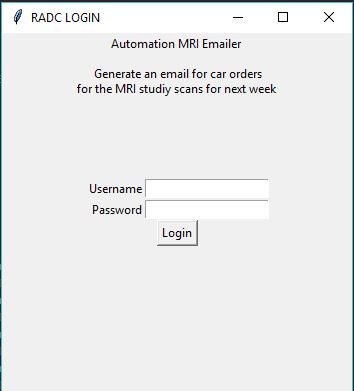
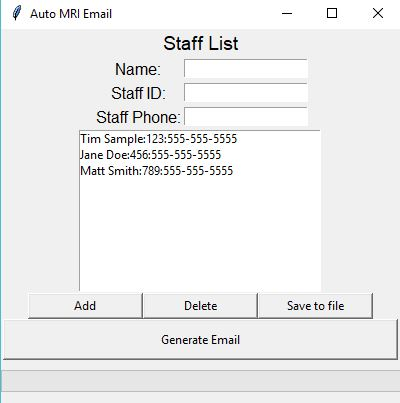
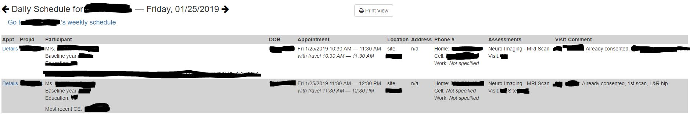
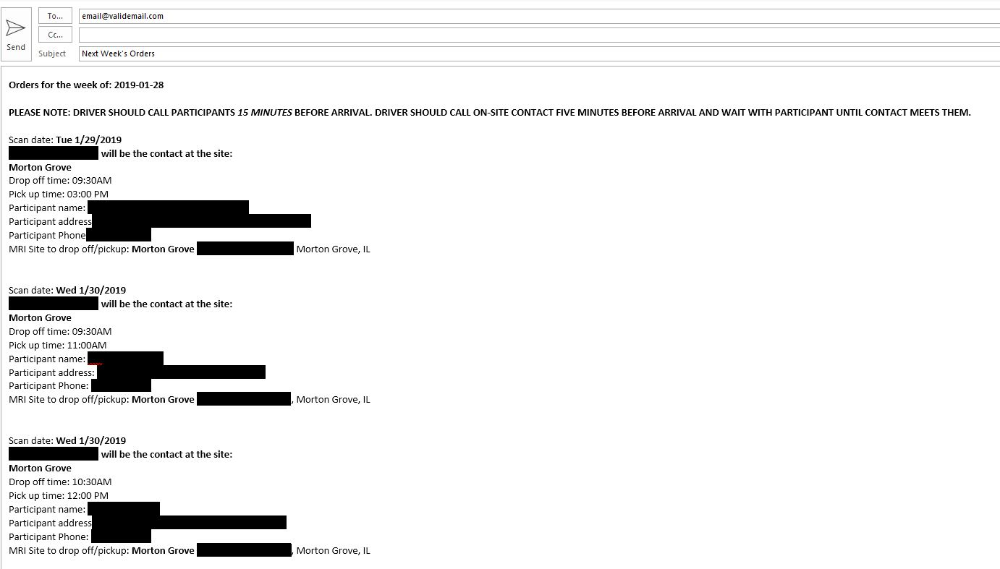

# Automate Emailer Through Webscraping

## This project webscrapes a scheduling site they automatically generates a form email to be sent based on that data. Build with a simple GUI for user control.

> The program is currently used for the specific purpose of generating a weekly email for car service orders based on the MRI scanning schedule of a research organization.

## 1. The Login Page
 
* In order to login into the scheduling site we must enter correct the correct username and password (if wrong the program will still allow you to enter but the email will not generate any details)

## 2. Set Staff to look at

* The next screen allows for the setting of staff and having that persist for each run through of the program. The staff fields are 
    * name
    * staff id (3 digit)
    * phone number
## Must "save to file" after adding new staff to use next run

## 3. The schedule that the program is webscraping looks like this
- Many redactions to protect privacy but the imortant part is the date and time info. 
- There is a schedule for each day for each staff memeber so the program polls each one to make sure there is an mri appointment and then pulls the date and time info as well as the location of the scan. (only 2 locations)

## 4. The resulting email looks like below.
- Can specify email address and cc as well as make it automatically send

